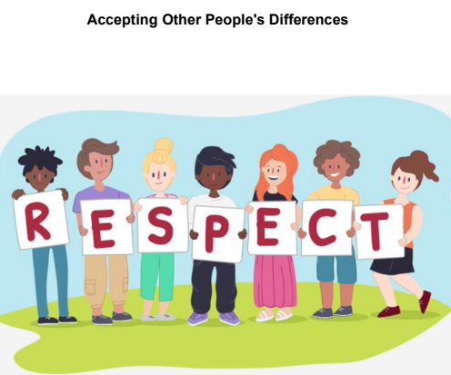

<h2><a href="../">Inglês Técnico 2022</a></h2>

 
 
 

 

- [x] <a href="/musica-pela-internet/"> Música: Pela internet - Cantor: Gilberto Gil; primeira musica lançada pela internet em tempo real no Brasil em 1996</a>

- [x] <a href=""> Avisos 2022</a>

- [x] <a href=""> Dicionário</a>

- [x] <a href=""> Dicas de inglês</a>

- [x] <a href=""> Fórum de Dúvidas</a>

- [x] <a href=""> A importância da disciplina de Inglês Técnico
</a>

- [x] <a href=""> Plano de Curso 2022</a>

- [x] <a href=""> Reading Strategies </a>

- [x] <a href=""> Avaliação diagnóstica</a>

- [x] <a href=""> Vídeo - Técnicas de leitura </a>

- [x] <a href=""> False Cognates</a>

- [x] <a href=""> Sugestões de filmes sobre: Tecnologia
 </a>

- [x] <a href=""> Music: Start me up. Rolling Stones (trilha sonora do lançamento do Windows95) </a>

